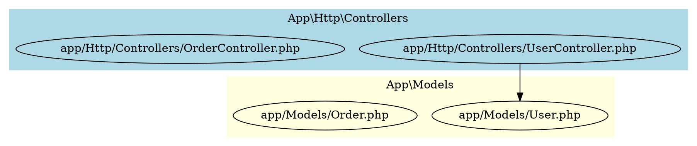

# Specs 03 — Code Structure, Clusters, and Data Flow

This document is an overview and backlog reference for the structural intelligence and data flow visibility enhancements to mapx. Individual feature specs are linked from the table below.

---

## Problem Statement

mapx currently produces a **flat file graph**: every file is a node, every import/call/instantiation is an edge. This is useful for understanding individual dependencies but loses the higher-order structure of the codebase:

- A 200-file Laravel app is not a bag of 200 files — it is 12 controllers, 18 models, 8 services, 6 providers, and a routing layer. The *groups* are as important as the individual files.
- A developer reviewing a feature does not think "what does `UserController.php` import?" — they think "how does the HTTP layer talk to the data layer, and where does user data enter and leave the system?"
- Current visualizations (flat DOT/SVG graphs) become unreadable above ~40 nodes. Cluster grouping makes 200-node graphs navigable.

Three complementary features address this:

| ID | Feature | What it adds |
|----|---------|-------------|
| F14 | Module / Domain Cluster Detection | Infers logical groups from namespace declarations, directory structure, and import density. Stores clusters in the graph database. |
| F15 | Cluster-Aware Export & Visualization | Renders clusters as DOT `subgraph cluster_*` blocks, adds `mapx clusters` CLI command, adds `--cluster` and `--depth` flags to export, adds cluster summary section to LLM export. |
| F16 | Data Flow Tracing | Traces call chains through the graph. `mapx trace <symbol>` shows how data propagates from a starting point. Identifies entry points, sinks, and the critical data path. |

---

## Architecture Overview

```
┌─────────────────────────────────────────────────┐
│                  Graph Database                  │
│  files  symbols  edges  clusters  flow_paths     │
└─────┬──────────────────────┬────────────────────┘
      │                      │
      ▼                      ▼
┌───────────┐         ┌────────────────┐
│  Cluster  │         │   FlowTracer   │
│  Engine   │         │  (F16)         │
│  (F14)    │         └───────┬────────┘
└─────┬─────┘                 │
      │                       │
      ▼                       ▼
┌──────────────────────────────────────┐
│          Export Layer (F15)          │
│  DotExporter  SvgExporter  LLM      │
│  ClusterDotExporter  TraceExporter  │
└──────────────────────────────────────┘
      │
      ▼
┌──────────────────────────────────────┐
│  CLI  /  MCP                         │
│  mapx clusters  mapx trace           │
│  mapx export --cluster --depth       │
└──────────────────────────────────────┘
```

---

## Cluster Detection Strategy (F14)

Clusters are inferred from three sources, applied in priority order:

### 1. Explicit namespace / module declarations (highest confidence — `verified`)

| Language | Construct | Cluster source |
|----------|-----------|----------------|
| PHP | `namespace App\Http\Controllers;` | `App.Http.Controllers` |
| TypeScript | `namespace Auth.Providers` | `Auth.Providers` |
| JavaScript | `package` directive in JSDoc | `package.name` |
| Go | `package controllers` | `controllers` (within module path) |
| Python | `__init__.py` in directory | directory path as package |

### 2. Directory structure (heuristic — `inferred`)

Group files by their containing directory. A directory with ≥ 2 files becomes a cluster named after the directory path relative to the project root.

Cluster hierarchy: `app/Http/Controllers/` → three levels:
- L1: `app`
- L2: `app.Http`
- L3: `app.Http.Controllers`

### 3. Edge density / community detection (algorithmic — `computed`)

Files with high mutual import density are likely to belong to the same logical domain even if their directory structure is flat. Apply a lightweight community detection algorithm (Label Propagation or greedy modularity maximisation) to identify these clusters.

Community clusters supplement, not replace, directory/namespace clusters.

---

## Cluster Export Modes (F15)

### DOT cluster subgraphs



### Top-down hierarchy view

`mapx export --format=dot --cluster=auto --depth=1` → one node per top-level cluster with aggregated edge counts.

### Bottom-up detail view

`mapx export --format=dot --cluster=none` → current flat graph (backward compatible default).

---

## Data Flow Concepts (F16)

A **data flow path** in the graph is a directed traversal using only data-bearing edge types:

```
call → instantiation → param_type → return_type → relation
```

Structural edges (`import`, `extends`, `implements`) represent code structure, not data movement. They are excluded from flow traces unless `--include-structural` is passed.

### Source, transform, sink model

```
Source          Transform         Sink
(entry point)   (processing)      (data consumer)

routes/api.php  OrderController   Database
   ↓ [route]       ↓ [call]          ↓ [call]
UserRequest →  UserService →    UserRepository
               (validates)       (persists)
```

### `mapx trace` output

```bash
mapx trace UserController::store --depth 4 --direction down

UserController::store
  └─[call]→ UserRequest::validated
  └─[call]→ UserService::create
       └─[call]→ User::fill
       └─[call]→ UserRepository::save
            └─[call]→ DB::table    (sink — external service)
            └─[relation]→ Role     (model relation — fan-out)
```

---

## Scope Boundaries

### In scope (F14–F16)

- Cluster detection from namespaces, directories, and edge density
- DOT cluster subgraph export with hierarchy depth control
- `mapx clusters` — list detected clusters and their membership counts
- LLM export cluster section (cluster-level summary before file list)
- `mapx trace <symbol>` — upstream/downstream call chain
- Source and sink detection on call graphs
- JSON and DOT output for trace results
- MCP tool equivalents for all new commands

### Out of scope

- Full SSA-based taint analysis (heavyweight — deferred)
- Cross-repository clusters (multi-repo graphs)
- Cluster name editing / manual overrides (deferred — configuration feature)
- Visual cluster editor (browser-based UI)
- Dependency cycle detection as a separate command (partially covered by F16 cycle detection, full cycles-only command deferred)
