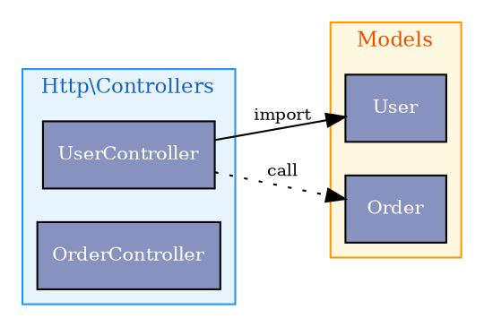
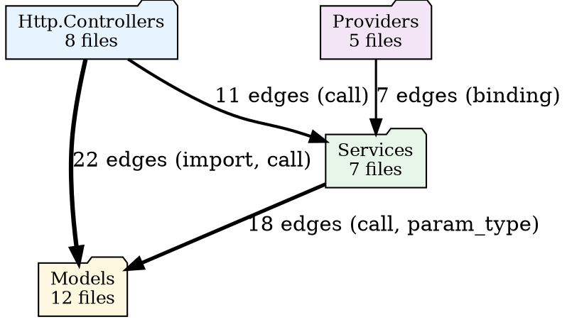

# F15 — Cluster-Aware Export & Visualization

| Field | Value |
|-------|-------|
| ID | F15 |
| Status | `planned` |
| Iteration | I08 |
| Branch | `feat/i08-clusters-and-flow` |
| Depends on | F14 (cluster detection engine) |
| Blocked by | F14 must be completed first |

---

## Problem

The existing DOT and SVG exporters produce flat graphs: every file is a node at the same visual level. For projects with more than ~40 files this becomes a hairball that conveys no useful structure.

Two specific problems:

1. **No hierarchy** — a 200-file Laravel app exports as 200 equal-weight nodes with hundreds of edges between them. The 12 distinct architectural layers are invisible.
2. **No zoom level** — there is no way to see the project "from above" (cluster-to-cluster dependencies) or drill into a single module. The resolution is fixed at file level.

F15 fixes both by adding a `--cluster` flag to `mapx export` and introducing cluster-aware rendering across the DOT, SVG, and LLM exporters.

---

## Goal

1. Add `--cluster` and `--depth` flags to `mapx export`
2. Implement `ClusterDotExporter` that wraps files in DOT `subgraph cluster_*` blocks
3. Implement a **cluster-level DOT view** where nodes are clusters, not files
4. Update `SvgExporter` to pass cluster context to `dot` and to the fallback renderer
5. Add a `## Structure` section to the LLM exporter output
6. Expose a `mapx_export` MCP tool update to support cluster format options

---

## New CLI flags

```
mapx export [--dir /path] [--format dot|svg|llm|json] [--cluster auto|namespace|directory|community|none] [--depth N] [--tokens N]
```

| Flag | Default | Description |
|------|---------|-------------|
| `--cluster auto` | `none` (backward compat) | Cluster source to use for grouping |
| `--cluster none` | — | Current flat graph (unchanged) |
| `--cluster auto` | — | Use `namespace` if available, else `directory` |
| `--cluster namespace` | — | Group by namespace declarations only |
| `--cluster directory` | — | Group by directory structure only |
| `--cluster community` | — | Group by computed community clusters only |
| `--depth N` | `99` (all levels) | Maximum cluster nesting depth to render |

**Backward compatibility**: the default is `--cluster none`, so all existing outputs are unchanged. Users opt in to cluster rendering explicitly.

---

## DOT cluster subgraph format

### Standard cluster view (files as nodes, grouped by cluster)

`mapx export --format=dot --cluster=auto`



### Cluster-level view (clusters as nodes, no individual files)

`mapx export --format=dot --cluster=auto --depth=1`

One node per cluster. Edge labels show aggregate edge count and dominant edge type.



Edge `penwidth` is proportional to `log(edgeCount) + 1`, capped at 5.

### Depth-limited nested view

`mapx export --format=dot --cluster=auto --depth=2`

Renders two levels of cluster nesting. Files inside level-2 clusters are shown; deeper clusters are collapsed into a single placeholder node.

---

## Cluster colour palette

Clusters at depth 0 (root) are assigned colours from a deterministic palette based on their name hash. Child clusters inherit a lighter tint of their parent's colour. This ensures visual consistency across re-runs.

```typescript
const CLUSTER_PALETTE = [
  '#E8F4FD', // blue tint
  '#FFF8E1', // amber tint
  '#E8F5E9', // green tint
  '#F3E5F5', // purple tint
  '#FCE4EC', // pink tint
  '#E0F2F1', // teal tint
  '#FBE9E7', // deep orange tint
  '#EDE7F6', // deep purple tint
];

function clusterColor(name: string): string {
  let hash = 0;
  for (const ch of name) hash = (hash * 31 + ch.charCodeAt(0)) | 0;
  return CLUSTER_PALETTE[Math.abs(hash) % CLUSTER_PALETTE.length];
}
```

---

## `ClusterDotExporter` class

New file: `src/exporters/cluster-dot-exporter.ts`

```typescript
export interface ClusterExportOptions {
  repo?: string;
  clusterSource: ClusterSource | 'auto' | 'none';
  depth: number;             // max nesting depth; 0 = clusters-only view
}

export class ClusterDotExporter {
  constructor(
    private store: Store,
    private graph: MapxGraph,
    private clusterEngine: ClusterEngine,
  ) {}

  export(options: ClusterExportOptions): string {
    if (options.clusterSource === 'none') {
      return new DotExporter(this.store, this.graph).export(options.repo);
    }

    if (options.depth === 0) {
      return this.exportClusterLevel(options);
    }

    return this.exportFileLevel(options);
  }

  private exportClusterLevel(options: ClusterExportOptions): string { ... }
  private exportFileLevel(options: ClusterExportOptions): string { ... }
  private buildSubgraph(cluster: Cluster, depth: number, maxDepth: number, files: string[]): string { ... }
  private buildClusterEdges(clusters: Cluster[], options: ClusterExportOptions): string { ... }
}
```

---

## SVG exporter update

`SvgExporter` is updated to accept cluster options. When `--cluster` is specified, it calls `ClusterDotExporter` instead of `DotExporter` to produce the DOT source, then pipes to `dot -Tsvg`.

The fallback SVG renderer (`renderFallback()`) is extended to draw cluster bounding boxes: a light-coloured filled rectangle behind each cluster's file nodes, with the cluster label above it.

```typescript
// Fallback SVG: add cluster bounding boxes
for (const cluster of clusters) {
  const filesInCluster = clusterEngine.getClusterFiles(cluster.name, repo);
  const clusterNodes = nodes.filter(n => filesInCluster.includes(n.path));
  if (clusterNodes.length === 0) continue;

  const minX = Math.min(...clusterNodes.map(n => n.x)) - CLUSTER_PAD;
  const minY = Math.min(...clusterNodes.map(n => n.y)) - CLUSTER_PAD - LABEL_H;
  const maxX = Math.max(...clusterNodes.map(n => n.x + n.w)) + CLUSTER_PAD;
  const maxY = Math.max(...clusterNodes.map(n => n.y + NODE_H)) + CLUSTER_PAD;

  svgLines.push(`<rect x="${minX}" y="${minY}" width="${maxX - minX}" height="${maxY - minY}"
    fill="${clusterColor(cluster.name)}" rx="8" opacity="0.6"/>`);
  svgLines.push(`<text x="${minX + 6}" y="${minY + 14}" font-size="11" fill="#555">${cluster.label}</text>`);
}
```

---

## LLM exporter — `## Structure` section

When clusters are available, the LLM exporter prepends a `## Structure` section before `## Files`:

```markdown
## Structure

app
  Http.Controllers  [8 files]  depends on: Models (22), Services (11)
  Models            [12 files]
  Services          [7 files]  depends on: Models (18)
  Providers         [5 files]  depends on: Services (7)
src
  core              [8 files]
  exporters         [5 files]  depends on: core (12)
  parsers           [11 files] depends on: core (6)
```

This section is ~200–400 tokens and replaces roughly 60% of the individual file list tokens for large projects, dramatically improving the signal-to-token ratio for LLM consumers.

When `--depth=0` (cluster view), the LLM exporter outputs **only** the structure section and omits the full file list.

---

## Interactive DOT navigation (aspirational, out of scope for I08)

Future: `mapx export --format=html` — a single-file interactive HTML output wrapping a d3-force graph with click-to-expand clusters. Noted here as a roadmap item, not implemented in I08.

---

## `mapx export` output format matrix

After F15, the full matrix of supported output combinations:

| Format | `--cluster none` | `--cluster auto --depth 1` | `--cluster auto --depth N` |
|--------|-----------------|---------------------------|---------------------------|
| `dot`  | ✓ flat (current) | ✓ cluster-nodes-only view | ✓ nested subgraph view |
| `svg`  | ✓ flat (current) | ✓ cluster-nodes SVG | ✓ subgraph SVG |
| `llm`  | ✓ flat (current) | ✓ structure-only section | ✓ structure + file list |
| `json` | ✓ flat (current) | ✓ clusters included | ✓ clusters + files |

---

## JSON export additions

When clusters exist, the JSON export includes a `clusters` key:

```json
{
  "repo": "mapx",
  "clusters": [
    {
      "name": "src.core",
      "label": "core",
      "source": "directory",
      "depth": 1,
      "fileCount": 8,
      "parentName": "src",
      "interClusterEdges": [
        { "targetCluster": "src.exporters", "edgeCount": 12, "dominantType": "import" }
      ]
    }
  ],
  "files": [ ... ],
  "edges": [ ... ]
}
```

---

## Acceptance Criteria

- [ ] `mapx export --format=dot --cluster=auto` produces valid DOT with `subgraph cluster_*` blocks
- [ ] `mapx export --format=dot --cluster=auto --depth=0` produces cluster-only view (no individual file nodes)
- [ ] `mapx export --format=dot --cluster=none` produces identical output to current flat export
- [ ] `mapx export --format=svg --cluster=auto` renders without crashing (graphviz path and fallback)
- [ ] Fallback SVG renderer draws cluster bounding boxes
- [ ] LLM export includes `## Structure` section when clusters are detected
- [ ] JSON export includes `clusters` array when clusters are detected
- [ ] `--depth 1` shows top-level clusters only; `--depth 2` shows two levels
- [ ] Cluster colours are deterministic (same name → same colour across re-runs)
- [ ] Edge `penwidth` scales with log of edge count
- [ ] MCP `mapx_export` tool accepts `cluster` and `depth` parameters
- [ ] Existing `mapx export` invocations without `--cluster` flag are unaffected (backward compat)
- [ ] TypeScript type-check passes

---

## Out of Scope for F15

- Interactive HTML export with d3 / click-to-expand
- Cluster-level diff visualization (changes between commits)
- Per-cluster export (export a single cluster as its own graph)
- Ranked cluster layout (place highest-dependency clusters at the top)
