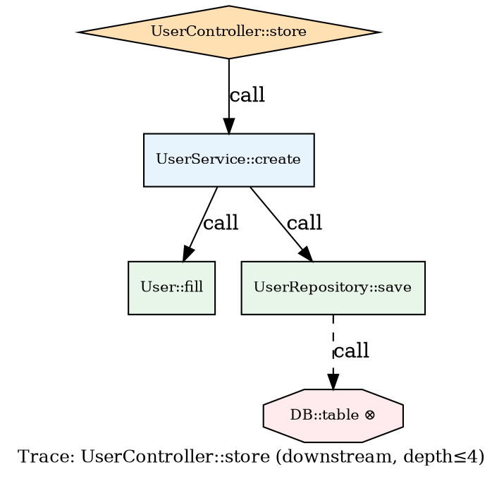

# F16 — Data Flow Tracing

| Field | Value |
|-------|-------|
| ID | F16 |
| Status | `planned` |
| Iteration | I08 |
| Branch | `feat/i08-clusters-and-flow` |
| Depends on | — (independent; richer with F07/F08/F09 Laravel edges) |
| Blocked by | — |

---

## Problem

The current graph answers structural questions: "what does X import?", "what calls Y?". It cannot answer **flow questions**: "how does a user's HTTP request reach the database?", "what happens to the data returned by `OrderService::create()`?", "where does payment data enter the system and where does it go?".

These flow questions are the most valuable for security audits, feature impact analysis, and onboarding. They require **chain traversal** — following sequences of edges through the graph from a starting point to all reachable endpoints (or from a point back to all sources that feed into it).

Without this:
- Understanding a feature requires manually tracing edges one file at a time
- Security audits of data paths are manual
- Onboarding developers need to read every file to understand what flows where
- LLM context about a feature area requires including every file in the chain

---

## Goal

1. Implement `FlowTracer` — a graph traversal engine that follows data-bearing edges in forward (downstream) and reverse (upstream) directions
2. Add `mapx trace <symbol|file>` CLI command with depth, direction, and format options
3. Add cycle detection and reporting in traced paths
4. Add **source and sink identification** — automatically find entry points and terminal consumers
5. Export traced paths as DOT subgraphs for targeted visualization
6. Add `mapx_trace` MCP tool

---

## Data-bearing vs structural edges

Not all edges carry data. The `FlowTracer` distinguishes:

### Data-bearing edges (included in traces by default)

| Edge type | Meaning | Flow direction |
|-----------|---------|----------------|
| `call` | A calls B — data flows as arguments/return | forward: A → B; backward: B ← A |
| `instantiation` | A creates B — data is the constructed object | forward: A → B |
| `param_type` | A's constructor receives B — B instance flows in | forward: B → A |
| `return_type` | A returns B — B instance flows out | forward: A → B |
| `relation` | Eloquent: A has-many B — B records associated with A | forward: A → B |
| `dispatch` | A dispatches event/job B — data passed to B | forward: A → B |
| `notify` | A sends notification B — data flows to B | forward: A → B |
| `route` | HTTP entry: request flows to controller | forward: route_file → controller |

### Structural edges (excluded from traces by default, opt-in with `--include-structural`)

| Edge type | Meaning |
|-----------|---------|
| `import` | Dependency declaration only — no data transfer |
| `require` | Dependency declaration only |
| `extends` | Inheritance — structural, not data flow |
| `implements` | Interface conformance — structural |
| `binding` | IoC registration — structural wiring |
| `middleware` | Request filter chain — structural |

---

## `FlowTracer` class

New file: `src/core/flow-tracer.ts`

```typescript
export type TraceDirection = 'down' | 'up' | 'both';

export interface TraceOptions {
  startSymbol?: string;     // e.g. "UserController::store"
  startFile?: string;       // e.g. "app/Http/Controllers/UserController.php"
  direction: TraceDirection;
  maxDepth: number;         // default 6
  edgeTypes?: ReferenceType[];  // override data-bearing edge filter
  includeStructural: boolean;   // default false
  repo?: string;
}

export interface TraceNode {
  file: string;
  symbol: string | null;
  depth: number;
  incomingEdgeType: ReferenceType | 'start';
}

export interface TracePath {
  nodes: TraceNode[];
  cycles: CyclicEdge[];
}

export interface CyclicEdge {
  fromFile: string;
  fromSymbol: string | null;
  toFile: string;
  toSymbol: string | null;
  edgeType: ReferenceType;
  cycleLength: number;
}

export interface TraceResult {
  start: { file: string; symbol: string | null };
  direction: TraceDirection;
  paths: TracePath[];
  sources: TraceNode[];     // nodes with no incoming data edges (entry points)
  sinks: TraceNode[];       // nodes with no outgoing data edges (terminal consumers)
  cycles: CyclicEdge[];     // all detected cycles in the traced subgraph
  nodeCount: number;
  edgeCount: number;
  maxDepthReached: boolean;
}

export class FlowTracer {
  constructor(private store: Store) {}

  trace(options: TraceOptions): TraceResult { ... }

  private traceForward(start: TraceNode, options: TraceOptions, visited: Set<string>): TraceNode[] { ... }
  private traceBackward(start: TraceNode, options: TraceOptions, visited: Set<string>): TraceNode[] { ... }

  findSources(repo?: string): TraceNode[] { ... }  // all files/symbols with 0 incoming data edges
  findSinks(repo?: string): TraceNode[] { ... }    // all files/symbols with 0 outgoing data edges
  findCriticalPath(from: string, to: string, repo?: string): TracePath | null { ... }
}
```

---

## `mapx trace` CLI command

```
mapx trace <symbol-or-file> [options]

Arguments:
  <symbol-or-file>   Symbol (e.g. "UserController::store") or file path

Options:
  --dir <path>       Project directory (default: cwd)
  --direction        up | down | both  (default: both)
  --depth <n>        Maximum traversal depth (default: 6)
  --format           text | dot | json  (default: text)
  --include-structural  Include import/extends edges in trace
  --sources          Show entry points (nodes with no incoming data edges)
  --sinks            Show terminal consumers (nodes with no outgoing data edges)
```

### Text output (default)

```
$ mapx trace "UserController::store" --direction down --depth 4

Trace: UserController::store  ↓ downstream  depth≤4
─────────────────────────────────────────────────────

UserController::store  (app/Http/Controllers/UserController.php)
  └─[call]─→  StoreUserRequest::validated          (app/Http/Requests/StoreUserRequest.php)
  └─[call]─→  UserService::create                  (app/Services/UserService.php)
       └─[call]─→  User::fill                      (app/Models/User.php)
       └─[call]─→  UserRepository::save            (app/Repositories/UserRepository.php)
            └─[call]─→  DB::table            ⊗ sink  (vendor facade → DatabaseManager)
            └─[relation]─→  Role             (app/Models/Role.php)
                 └─[call]─→  DB::table       ⊗ sink  (cycle at depth 4)
  └─[dispatch]─→  UserRegistered             (app/Events/UserRegistered.php)
       └─[call]─→  SendWelcomeEmail          ⊗ sink  (app/Listeners/SendWelcomeEmail.php)

Nodes: 10   Edges: 9   Max depth: 4   Cycles: 0
Sinks: DB::table (×2), SendWelcomeEmail
```

Symbols:
- `⊗ sink` — node has no outgoing data edges (terminal consumer)
- `↻` — cycle detected at this node (back-reference to an ancestor in the path)
- `⊕ source` — would appear in upstream trace

### DOT output

`mapx trace "UserController::store" --format=dot`

Emits a DOT subgraph of only the traced nodes and edges — ideal for targeted visualization of a single feature's data path:



**Node shapes**:
- `diamond` — the trace start node
- `octagon` — sink node (terminal consumer)
- `box` — intermediate node
- `ellipse` — source node (no incoming data edges)

### JSON output

```json
{
  "start": { "file": "app/Http/Controllers/UserController.php", "symbol": "UserController::store" },
  "direction": "down",
  "maxDepth": 4,
  "nodeCount": 10,
  "edgeCount": 9,
  "maxDepthReached": false,
  "sources": [],
  "sinks": [
    { "file": "vendor/illuminate/database", "symbol": "DatabaseManager::table", "depth": 4, "incomingEdgeType": "call" }
  ],
  "cycles": [],
  "nodes": [
    { "file": "app/Http/Controllers/UserController.php", "symbol": "UserController::store", "depth": 0, "incomingEdgeType": "start" },
    { "file": "app/Services/UserService.php", "symbol": "UserService::create", "depth": 1, "incomingEdgeType": "call" }
  ],
  "edges": [
    { "from": "app/Http/Controllers/UserController.php", "to": "app/Services/UserService.php", "edgeType": "call", "fromSymbol": "UserController::store", "toSymbol": "UserService::create" }
  ]
}
```

---

## Source and sink discovery

### `mapx trace --sources`

Lists all **entry points** in the project — symbols/files with incoming data edges only from routes, controllers, or no data predecessors at all.

```
$ mapx trace --sources

Entry points (data sources) — 6 found:
  routes/api.php                          [route file — 12 controller endpoints]
  routes/web.php                          [route file — 8 controller endpoints]
  app/Console/Kernel.php                  [no incoming data edges]
  app/Jobs/ProcessOrder.php               [dispatched externally — queue worker]
  app/Listeners/SendWelcomeEmail.php      [event listener — external trigger]
  app/Http/Middleware/Authenticate.php    [middleware — filter chain entry]
```

### `mapx trace --sinks`

Lists all **terminal consumers** — files/symbols with outgoing data edges only to external systems (DB, queue, mail, cache, HTTP clients) or no outgoing data edges at all.

```
$ mapx trace --sinks

Terminal consumers (data sinks) — 8 found:
  Illuminate\Database\DatabaseManager    [DB facade → raw SQL — 34 in-edges]
  Illuminate\Cache\CacheManager          [Cache facade → Redis/Memcache — 12 in-edges]
  Illuminate\Mail\Mailer                 [Mail facade → SMTP — 4 in-edges]
  Illuminate\Queue\QueueManager          [Queue::push — 7 in-edges]
  app/Repositories/UserRepository.php    [terminal — no outgoing data edges]
  app/Repositories/OrderRepository.php   [terminal — no outgoing data edges]
```

---

## Critical path

`mapx trace <from> --to <target>` — finds the shortest data-bearing path between two symbols/files.

```
$ mapx trace "routes/api.php" --to "DatabaseManager" --format text

Critical data path: routes/api.php → DatabaseManager
Length: 4 hops

routes/api.php
  └─[route]─→  UserController::index
       └─[call]─→  UserRepository::all
            └─[call]─→  DB::select
                 └─[call]─→  DatabaseManager::select  ⊗
```

---

## Cycle detection

The `FlowTracer` detects cycles (circular call chains) during traversal using a DFS + visited-on-current-path set. Detected cycles are reported in the output:

```
⚠ Cycle detected:
  ServiceA::process → ServiceB::handle → ServiceC::dispatch → ServiceA::process
  Length: 3 hops
  Impact: 8 downstream nodes unreachable from non-cyclic path
```

Cycles do not abort the trace — they are recorded and traversal continues on other branches.

---

## Integration with LLM export

When `mapx export --format=llm` is called on a project with traces, the exporter can include high-level data flow summaries:

```markdown
## Data Flow Summary

Entry points: routes/api.php (12 endpoints), routes/web.php (8 endpoints)

Critical paths:
- HTTP → UserController → UserService → UserRepository → DB (depth 4)
- HTTP → OrderController → PaymentService → Stripe API (depth 3)

Sinks: DatabaseManager (34 calls), CacheManager (12 calls), Mailer (4 calls)

Cycles detected: 0
```

This section is emitted only when clusters or flow data is available and costs ~150–300 tokens.

---

## `mapx_trace` MCP tool

```typescript
{
  name: "mapx_trace",
  description: "Trace data flow paths from a starting symbol or file. Returns upstream callers (up), downstream callees (down), or both. Use this to understand how data moves through the codebase.",
  inputSchema: {
    type: "object",
    required: ["start"],
    properties: {
      start:              { type: "string", description: "Symbol (e.g. 'UserController::store') or file path" },
      direction:          { type: "string", enum: ["up", "down", "both"], default: "both" },
      depth:              { type: "number", default: 6, description: "Max traversal depth" },
      format:             { type: "string", enum: ["text", "dot", "json"], default: "text" },
      include_structural: { type: "boolean", default: false },
    }
  }
}
```

---

## `mapx_sources` and `mapx_sinks` MCP tools

```typescript
{
  name: "mapx_sources",
  description: "Find all entry points in the codebase — files/symbols with no incoming data-flow edges. Useful for understanding where data enters the system."
}

{
  name: "mapx_sinks",
  description: "Find all terminal consumers — files/symbols with no outgoing data-flow edges. Useful for identifying where data is persisted, queued, or sent externally."
}
```

---

## Acceptance Criteria

- [ ] `mapx trace UserController` finds downstream call chain
- [ ] `mapx trace UserController --direction up` finds callers (routes)
- [ ] `mapx trace UserController --direction both` finds full bidirectional chain
- [ ] `--depth 3` stops traversal at depth 3
- [ ] `--format=dot` produces valid DOT with diamond start node, octagon sink nodes
- [ ] `--format=json` produces valid JSON with `nodes`, `edges`, `sources`, `sinks`
- [ ] Cycle detection correctly identifies and reports circular call chains
- [ ] `mapx trace --sources` lists entry points
- [ ] `mapx trace --sinks` lists terminal consumers
- [ ] `mapx trace A --to B` finds shortest path between A and B
- [ ] `mapx_trace` MCP tool responds correctly
- [ ] `mapx_sources` and `mapx_sinks` MCP tools respond correctly
- [ ] Data-bearing edge filter: `import`/`extends` not followed by default
- [ ] `--include-structural` adds import/extends to traversal
- [ ] TypeScript type-check passes
- [ ] Trace on 200-file project completes in < 500ms

---

## Out of Scope for F16

- Full SSA / taint tracking (field-level data propagation) — heavyweight, deferred
- Cross-process tracing (HTTP client calls to external services) — deferred
- Test coverage tracing (which tests exercise which data paths) — deferred
- Automatic security sink labelling (SQL injection, XSS sinks) — deferred, security analysis feature
- Data flow diff across git commits — deferred
